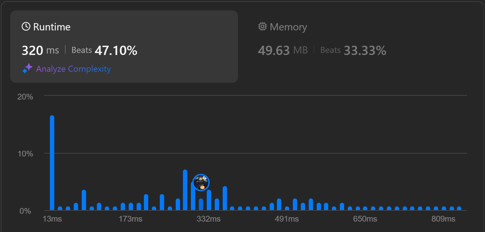
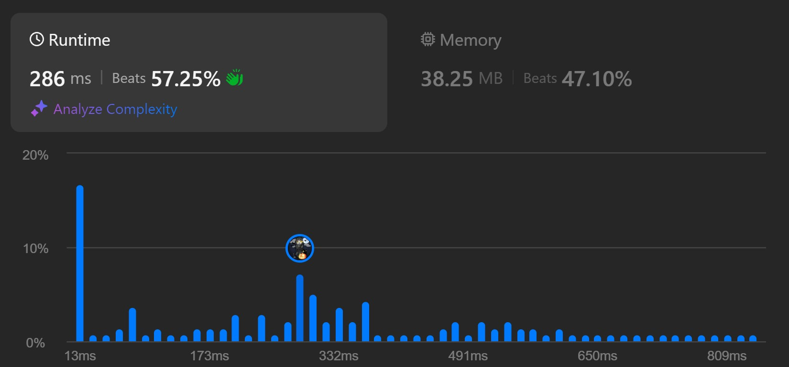

## مقدمه

اخیرا سوال [1584. Min Cost to Connect All Points](https://leetcode.com/problems/min-cost-to-connect-all-points/description/) از Leetcode رو داشتم حل می‌کردم که هدف اصلی سوال پیاده‌سازی یه الگوریتم `MST` بود. مونده بودم پریم بزنم یا کراسکال. یکم که فکر کردم، احساس کردم پیاده‌سازی کراسکال آسون‌تره و اون رو انتخاب کردم 😁

اگر نمی‌دونید بدونید که توی کراسکال اول باید بیایم همه‌ی یال‌ها رو بر اساس وزنشون مرتب کنیم و بعد دونه‌دونه از اونی که وزنش کم‌تره انتخاب کنیم و درخت رو تشکیل بدیم. اما باید هر بار چک کنیم که توی گراف دور ایجاد نشه. هر جا هم که درخت تشکیل شد (مثلا تعداد یال‌ها فقط یکی کمتر از تعداد راس‌ها بود) الگوریتم تموم میشه.

 اگر نمی‌دونید بدونید که توی پریم دوتا مجموعه باید نگه داریم. یه مجموعه از راس‌هایی که انتخاب شدن برای تشکیل درخت، یه مجموعه هم راس‌هایی که انتخاب نشدن هنوز. بعد هر بار باید کم وزن‌ترین یالی که یه سرش توی مجموعه اوله و یه سرش توی مجموعه دوم هست رو انتخاب کنیم. دیگه هم لازم نیست چک کنیم دور تشکیل شده یا نه.

وقتی با کراسکال پیاده‌سازی کردم نتیجش شد این:

بعدش یکم با کد ور رفتم ببینم نتیجه بهتری میده یا نه، دیدم بازم همون طوری موند.

گفتم حتما با پریم می‌رفتم بهتر بود 😁 (منطق انتخاب الگوریتم من!)

با پریم زدم و نتیجش شد این:

با خودم گفتم حتما یه جایی می‌لنگه دیگه. یکم جستجو کردم ببینم واقعا فرق این دوتا چیه و کجا باید چی رو استفاده کنیم و چی رو نکنیم.

## کراسکال یا پریم

طبق [منبع استک اور فلو](https://stackoverflow.com/questions/1195872/when-should-i-use-kruskal-as-opposed-to-prim-and-vice-versa): 
الگوریتم پریم برای زمانی خوب است که استفاده شود که گراف ما تعداد یال‌های زیادی نسبت به راس‌هایش دارد. مانند سوال Leetcodeی که لینکش را در بالا قرار دادم؛ گراف آن مسئله یک گراف کامل بوده است.

> ولی مشکل فقط این نبوده. پیاده‌سازی دوتا الگوریتم من اصلا بهینه نبوده.

پیچیدگی زمانی الگوریتم پریم برابر `O(E + V log V)` و پیچیدگی زمانی کراسکال برابر `O(E log V)` است. که `E` برابر تعداد یال‌ها و `V` برابر تعداد راس‌ها است.

برای پیاده‌سازی الگوریتم پریم باید از ساختمان داده **Heap** یا همان **Priority Queue** استفاده کنیم. البته خیلی بهتر از آن هم ساختمان داده **Fibonacci Heap** است. (اصلا نمیدونم چیه)

برای پیاده‌سازی الگوریتم کراسکال باید از ساختمان داده **Union-Find** یا همان **Disjoint-Set** استفاده کنیم.

> طبیعیه که پیاده‌سازی کراسکال راحت‌تر از پریم باشه. به قول یکی از کامنت‌های استک اور فلو، کی اصلا فیبوناچی هیپ می‌دونه چیه :)

یه بار دیگه کراسکال رو پیاده‌سازی کردم ولی این بار با مجموعه‌های مجزا و نتیجش شد این:

خیلی فرقی نکرد ولی کاملا مشخصه که کراسکال خیلی اینجا زورش نمی‌رسه. چون کد اون‌هایی که سریع‌تره با پریم زدن (به خاطر اینکه گراف مسئله یال‌هاش زیاد بوده)

